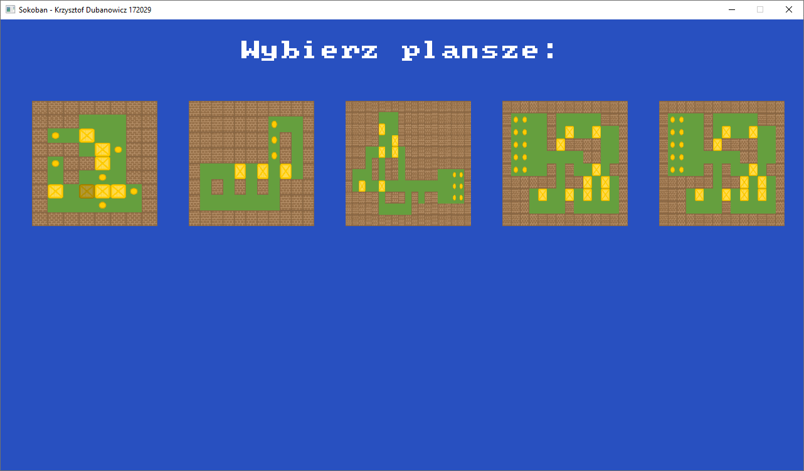
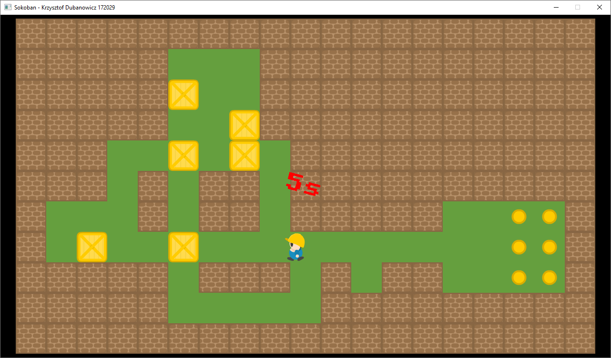

# SokobanSDL

Sokoban is a classic puzzle game, where you place boxes on the desitanted places.

SokobanSDL is an implementation of this game in C++ and SDL, written as an academic project in 2017. It has not been updated since then. Today i would stick more to SOLID principles and separate the classes dependencies.

### Features
* Preloaded boards
* Dynamic custom board loading
* Animations
* Board timewatch

### Tileset
[Sokoban tileset link](https://opengameart.org/content/sokoban-pack)

